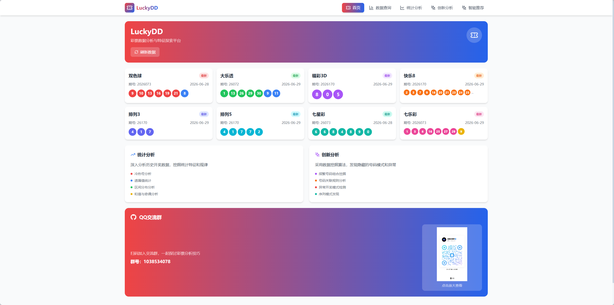
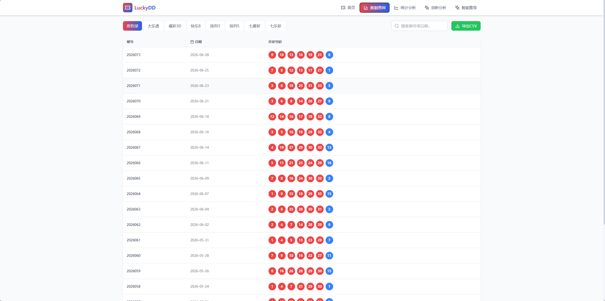
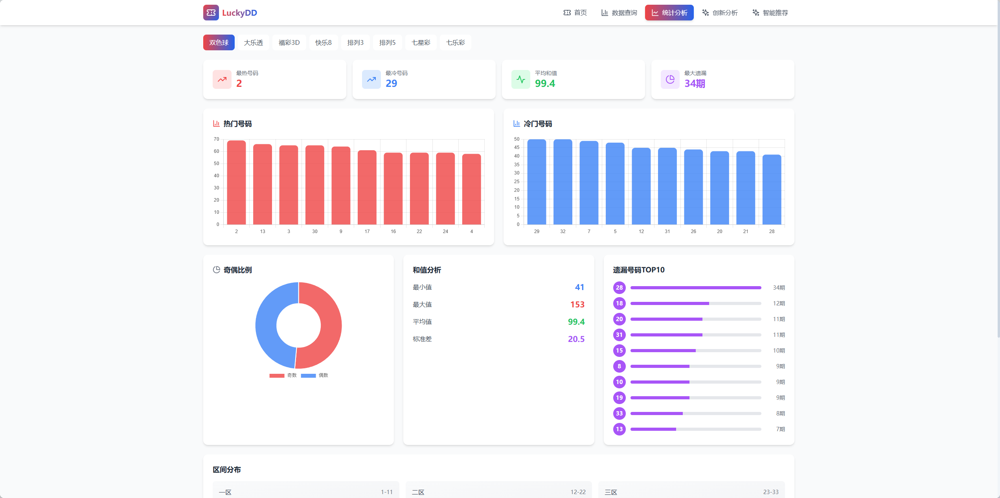
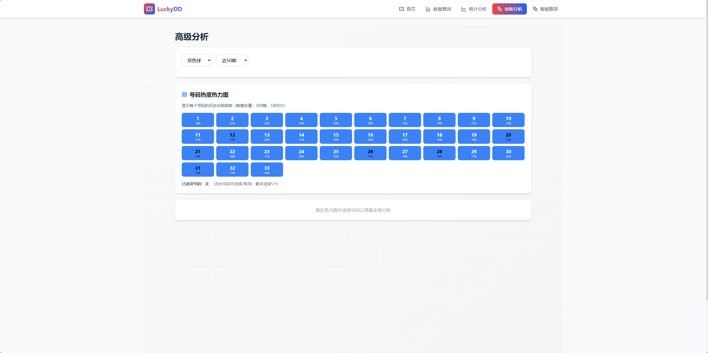
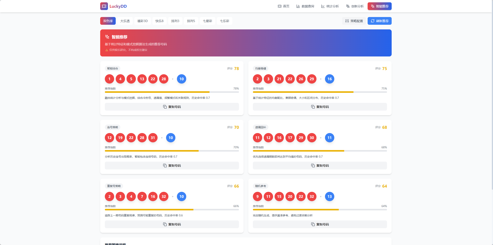
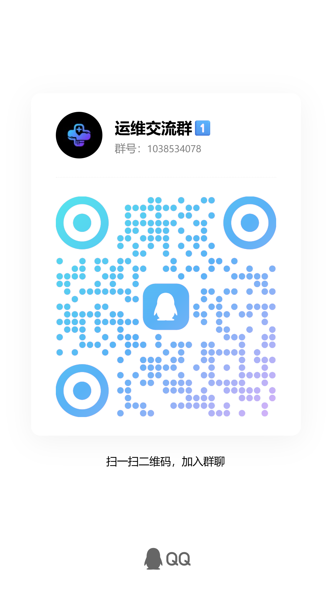

# LuckyDD - 彩票数据分析与特征探索平台

> **仅供娱乐研究使用** - 彩票开奖为随机事件，本平台分析结果不构成任何投注建议。

---

## � 项目预览

### 首页 - 最新开奖


查看所有彩种的最新开奖结果，一键刷新数据

### 数据查询


历史开奖数据列表，支持分页、筛选和CSV导出

### 统计分析


深度分析历史数据，挖掘统计特征和规律

### 创新分析


创新分析历史数据，挖掘频率和走势

### 智能推荐


基于算法生成推荐号码，多种策略可选

---

## �📋 项目简介

LuckyDD 是一个基于 Vue 3 + Node.js 的彩票数据分析平台，支持多种数字彩（双色球、大乐透、福彩3D、快乐8、排列3/5、七星彩、七乐彩）的历史数据采集、统计分析和特征探索。

### 核心功能
- 📊 **数据采集** - 自动爬取最新开奖数据，支持手动更新
- 📈 **统计分析** - 冷热号、遗漏值、区间分布、和值分析
- 🔍 **创新分析** - 模式挖掘、异常检测、序列模式分析
- 📉 **走势分析** - 号码走势图、热度热力图
- 🎯 **智能推荐** - 多策略推荐算法（智能混合、平衡分布、随机生成）
- 📱 **PWA支持** - 可安装为安卓应用，支持离线访问

---

## 🛠 技术栈

### 前端
- **框架**: Vue 3 + TypeScript
- **构建工具**: Vite
- **样式**: TailwindCSS
- **图表**: Chart.js
- **状态管理**: Pinia
- **路由**: Vue Router
- **PWA**: Vite PWA Plugin

### 后端
- **框架**: Express + TypeScript
- **爬虫**: Axios + Cheerio
- **数据库**: JSON 文件存储
- **定时任务**: node-cron
- **跨域**: CORS

---

## 📁 项目结构

```
lucky-dd/
├── backend/                 # 后端服务
│   ├── src/
│   │   ├── analysis/       # 分析模块
│   │   │   ├── statistics.ts       # 统计分析
│   │   │   ├── patternMining.ts    # 模式挖掘
│   │   │   ├── anomalyDetection.ts # 异常检测
│   │   │   └── recommendation.ts    # 智能推荐
│   │   ├── crawler/        # 数据爬虫
│   │   ├── routes/         # API路由
│   │   ├── utils/          # 工具类
│   │   └── index.ts        # 入口文件
│   ├── dist/               # 编译输出
│   └── package.json
├── frontend/               # 前端应用
│   ├── src/
│   │   ├── components/     # 组件
│   │   ├── views/          # 页面
│   │   ├── router/         # 路由
│   │   └── main.ts         # 入口文件
│   └── package.json
└── README.md
```

---

## 🚀 快速开始

### 环境要求
- Node.js >= 18.0.0
- npm >= 9.0.0

### 安装依赖

```bash
# 安装后端依赖
cd backend
npm install

# 安装前端依赖
cd ../frontend
npm install
```

### 启动服务

#### 启动后端（端口 3000）
```bash
cd backend
npm run build    # 首次运行需要编译
npm start
```

或开发模式：
```bash
npm run dev      # 热重载
```

#### 启动前端（端口 5174）
```bash
cd frontend
npm run dev
```

### 访问应用
打开浏览器访问: `http://localhost:5174`

---

## 📡 API 接口

### 彩票数据
| 接口 | 方法 | 说明 |
|------|------|------|
| `/api/lottery/{type}` | GET | 获取彩种列表 |
| `/api/lottery/latest/{type}` | GET | 获取最新开奖 |
| `/api/lottery/list/{type}` | GET | 分页查询 |

### 数据爬虫
| 接口 | 方法 | 说明 |
|------|------|------|
| `/api/crawler/update` | POST | 手动更新数据 |
| `/api/crawler/status` | GET | 爬虫状态 |
| `/api/crawler/reset` | POST | 重置数据库 |

### 统计分析
| 接口 | 方法 | 说明 |
|------|------|------|
| `/api/analysis/statistics/{type}` | GET | 基础统计 |
| `/api/analysis/patterns/{type}` | GET | 模式分析 |
| `/api/analysis/anomalies/{type}` | GET | 异常检测 |
| `/api/analysis/recommendations/{type}` | GET | 智能推荐 |

### 创新分析
| 接口 | 方法 | 说明 |
|------|------|------|
| `/api/advanced/trends/{type}` | GET | 走势分析 |
| `/api/advanced/heatmap/{type}` | GET | 热力图 |
| `/api/advanced/sequences/{type}` | GET | 序列模式 |

---

## 🎨 功能特性

### 1. 数据查询
- 历史开奖数据列表
- 支持按日期、期号筛选
- 分页查询

### 2. 统计分析
- **冷热号统计**: 号码出现频率排序
- **遗漏值分析**: 号码未开出期数
- **奇偶分布**: 奇偶号码比例
- **大小分布**: 大小区间分布
- **和值分析**: 和值范围统计

### 3. 创新分析
- **走势图**: 可视化号码出现趋势
- **热力图**: 号码热度可视化
- **模式挖掘**: 频繁号码组合发现
- **序列模式**: 连号、重号等模式分析
- **异常检测**: 识别异常开奖模式

### 4. 智能推荐
- **智能混合**: 综合冷热号、遗漏值、模式
- **平衡分布**: 奇偶、大小区间平衡
- **随机生成**: 随机号码参考
- **策略配置**: 可调整推荐策略权重

---

## 📱 安卓移动端适配 (Android)

本项目已通过 **Capacitor** 深度适配安卓原生环境，支持打包为 `.apk` 并在手机上流畅运行。

### 核心适配特性
- 🚀 **原生性能** - 基于 WebView + Capacitor，兼具 Web 开发效率与原生体验。
- 📊 **图表沉浸式横屏** - 在“高级分析”中支持一键切换横屏，全屏查看号码走势，解决小屏拥挤问题。
- 📤 **原生文件导出** - 导出 CSV 功能已对接系统原生分享，支持直接发送到微信、QQ 或保存到手机存储。
- 🌐 **自动环境切换** - 应用启动时自动识别环境并连接宿主机后端（模拟器 `10.0.2.2` 或自定义 IP）。

### 安卓开发环境要求
- Android Studio (最新版)
- Android SDK (API 30+)
- Gradle 8.14.4+

### 完整构建流程（命令行）

#### 1. 安装安卓依赖
```bash
cd frontend
npm install @capacitor/android @capacitor/filesystem @capacitor/share @capacitor/screen-orientation
npx cap add android    # 首次初始化安卓项目
```

#### 2. 构建前端并同步到安卓
```bash
npm run build
npx cap sync android
```

#### 3. 编译 APK（Debug 版本）
```bash
cd android
.\gradlew clean assembleDebug
```
输出文件：`app/build/outputs/apk/debug/app-debug.apk`

#### 4. 安装到模拟器/真机
```bash
# 安装到模拟器
adb -s emulator-5554 install -r app/build/outputs/apk/debug/app-debug.apk

# 安装到真机（连接设备后）
adb install -r app/build/outputs/apk/debug/app-debug.apk
```

#### 5. 启动应用
```bash
adb -s emulator-5554 shell am start -n com.luckydd.app/com.luckydd.app.MainActivity
```

### 一键构建脚本
```bash
cd frontend; npm run build; npx cap sync android; cd android; .\gradlew clean assembleDebug; adb -s emulator-5554 install -r app/build/outputs/apk/debug/app-debug.apk; adb -s emulator-5554 shell am start -n com.luckydd.app/com.luckydd.app.MainActivity
```

### 注意事项
- **网络访问**: 安卓项目已开启 `usesCleartextTraffic="true"` 以支持 HTTP 调试。
- **后端地址**: 若在真机调试，请修改 `frontend/src/main.ts` 中的 `axios.defaults.baseURL` 为您电脑的内网 IP。
- **图标格式**: Android 资源目录仅支持 `.png` 和 `.xml` 格式，不支持 `.svg`。

---

## 📱 PWA 功能

本应用支持渐进式 Web 应用 (PWA)，可以：
- 在安卓设备上安装为独立应用
- 离线缓存静态资源
- 快速启动，类似原生应用体验

---

## ⚙️ 配置说明

### 数据源
当前数据源：`https://www.8200.cn/`

支持彩种：
- 双色球: `https://www.8200.cn/kjh/ssq/history.htm`
- 大乐透: `https://www.8200.cn/kjh/dlt/history.htm`
- 福彩3D: `https://www.8200.cn/kjh/3d/history.htm`
- 快乐8: `https://www.8200.cn/kjh/kl8/history.htm`
- 排列3: `https://www.8200.cn/kjh/p3/history.htm`
- 排列5: `https://www.8200.cn/kjh/p5/history.htm`
- 七星彩: `https://www.8200.cn/kjh/qxc/history.htm`
- 七乐彩: `https://www.8200.cn/kjh/qlc/history.htm`

### 端口配置
- 后端: 3000 (可在 `.env` 中配置 `PORT`)
- 前端: 5174 (Vite 自动分配)

---

## 📊 数据说明

### 数据存储
- 使用 JSON 文件存储数据库
- 位置: `backend/dist/data/database.json`
- 支持数据库重置和重建

### 数据更新
- 自动更新: 每天开奖后触发
- 手动更新: 访问 `/api/crawler/update` 接口
- 数据去重: 根据期号自动去重

---

## ⚠️ 免责声明

> 本平台所有分析结果仅供娱乐研究目的，不构成任何形式的投注建议或投资指导。彩票开奖结果为随机事件，任何统计分析、模式挖掘或智能推荐均无法预测未来开奖结果。用户应理性对待彩票，量力而行。

### 使用须知
- ✅ 仅供个人娱乐研究使用
- ✅ 数据来源公开可访问
- ✅ 遵守目标网站 robots.txt
- ❌ 不提供投注功能
- ❌ 不构成任何投资建议

---

## 📝 开发计划

- [ ] 增加更多数据源备份
- [ ] 优化爬虫稳定性
- [ ] 增加更多分析维度
- [ ] 移动端UI优化
- [ ] 添加用户反馈功能

---

## 🤝 贡献

欢迎提交 Issue 和 Pull Request！

---

## 🤝 交流



---

## 📄 许可证

本项目仅供学习研究使用，不得用于商业目的。

---

**💡 提示**: 首次运行需要先启动后端服务，然后手动触发数据更新：`POST http://localhost:3000/api/crawler/update`